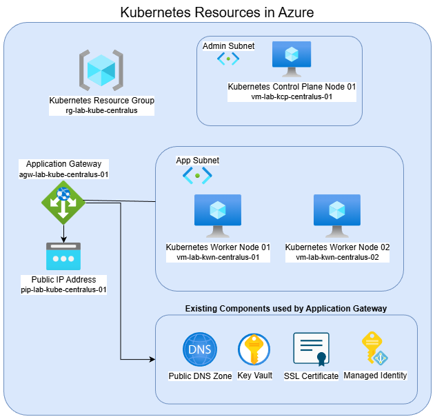
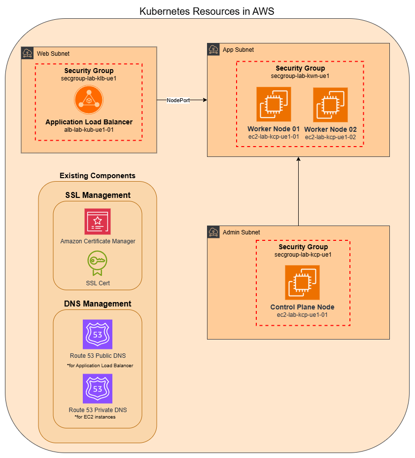

# Kubernetes Platform Framework

This project provides a framework for building, deploying, and managing a Kubernetes cluster on virtual machines. Included are Terraform files for the infrastructure build and Ansible playbooks to deploy a Kubernetes cluster with a control plane and worker nodes.

## Supported Cloud Platforms
This framework supports infrastructure provisioning and Kubernetes deployment on both Azure and AWS cloud platforms.

## Use Case
Please see the [Case Study](./CASESTUDY.md) for more information on the scenario this project covers.

## Azure

Note: The VNet and subnets are assumed to already exist and are not provisioned by this IaC project.

### Required Components
The following Azure resources are required as prerequisites before initiating the Terraform infrastructure build.

- Azure Virtual Network (VNet) and subnets
- Azure Public DNS Zone
- Azure Key Vault with an existing SSL certificate
- Azure Managed Identity with Key Vault access

## AWS

### Required Components
The following AWS resources are required as prerequisites before initiating the Terraform infrastructure build.

- AWS VPC and subnets
- Route 53 Public DNS Zone
- Route 53 Private DNS Zone
- Existing SSL/TLS certificate in AWS Certificate Manager

## CNIs Supported

This project supports multiple Container Network Interface (CNI) plugins:

- **Cilium** - [A modern, eBPF-based CNI that provides advanced networking, observability, and security capabilities](https://cilium.io/)
- **Calico** - [A widely-used CNI offering policy-based networking and high performance](https://www.tigera.io/project-calico/)

You can choose either CNI based on your specific requirements and use case.

## Additional Components Deployed
The project includes pre-configured tooling to streamline application deployment and traffic management:

- **Helm** - Package manager for Kubernetes
- **NGINX Gateway Fabric** - Kubernetes Gateway API implementation

## Operating System Support
This project supports **Ubuntu** as the operating system for both Kubernetes control plane and worker node virtual machines. Other operating systems are not currently supported.

## Optional Components
- **Health Check App** - An optional health check that can be deployed to Kubernetes for monitoring and validating cluster health and component availability.

## License
This project is licensed under the MIT License. See the LICENSE file for details.
